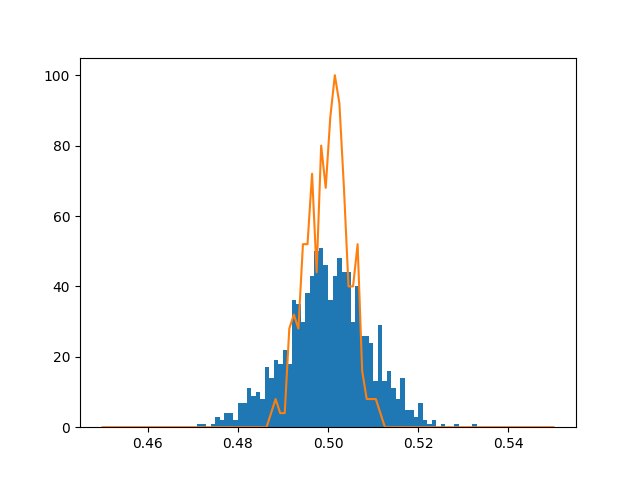

---

This package brings Haskell's well-loved applicative functor interface to Python in the important special case of the _identity applicative_. This allows you to write code like the following:

```python
from src.y.y import y
from matplotlib import pyplot as plt
import numpy as np

y / np.random.random([1000, 1000]) /\
    np.average @ {'axis': 0} /\
    plt.hist @ {'bins': 100, 'range': (0.45, 0.55)} %\
    np.reshape * (4, -1) /\
    np.average @ {'axis': 0} /\
    np.histogram @ {'bins': 100, 'range': (0.45, 0.55)} /\
    (lambda x: x[0]) /\
    np.multiply * 4 /\
    (lambda y, x: plt.plot(x, y)) * np.linspace(0.45, 0.55, 100) %\
    ...
plt.show()
```


